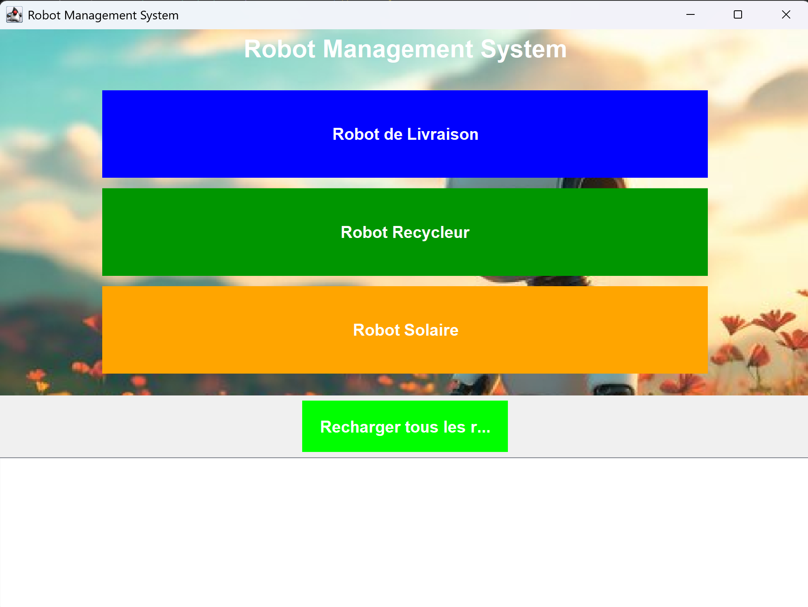
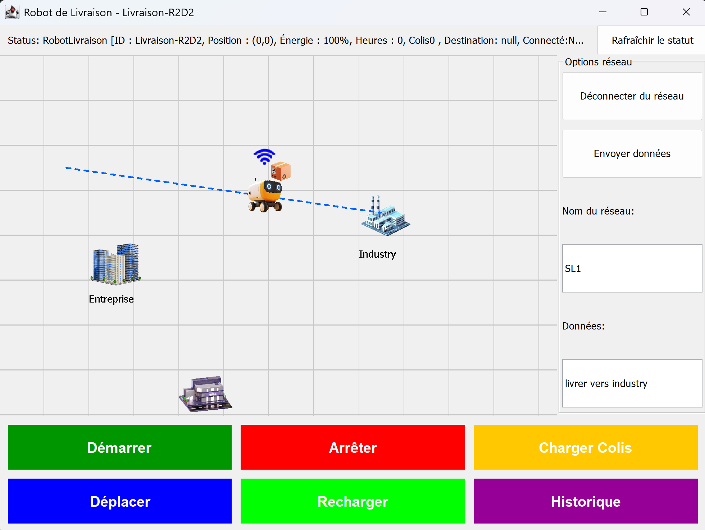
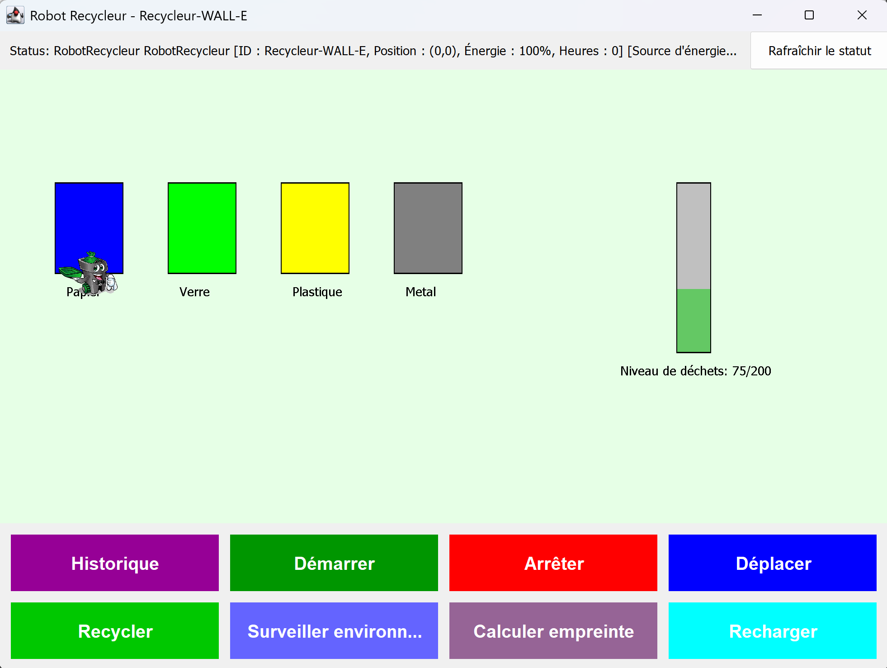
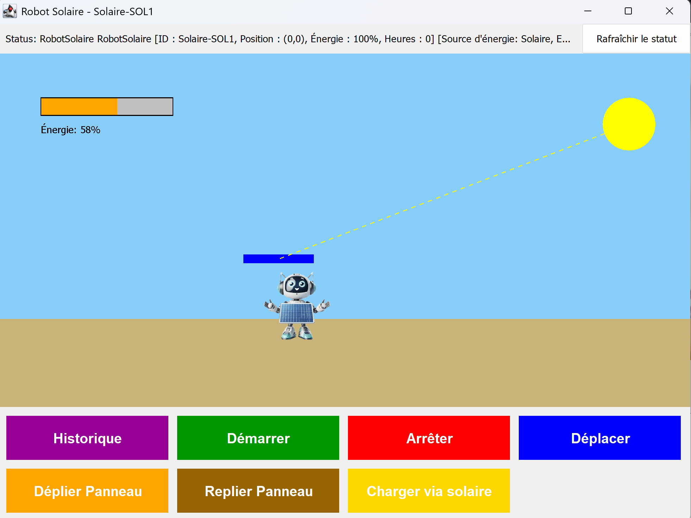
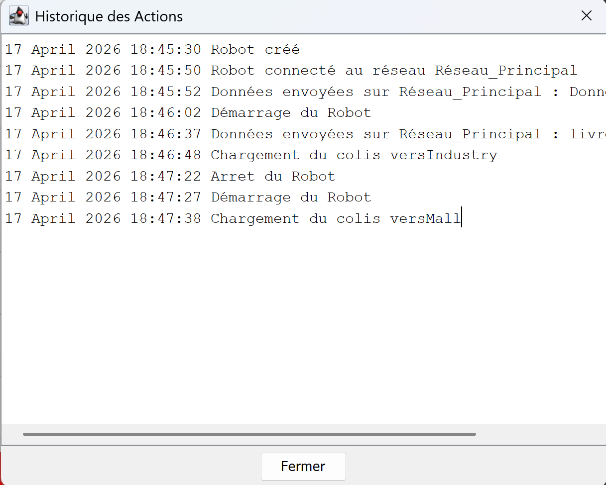

# 🌿 Ecological Robots Management System

A Java-based desktop application for managing and monitoring ecological robots with various specialized functions including delivery, recycling, solar energy collection, and environmental monitoring.

---

## 📋 Table of Contents

- [Overview](#overview)
- [Features](#features)
- [Robot Types](#robot-types)
- [Architecture](#architecture)
- [Custom Exceptions](#custom-exceptions)
- [Getting Started](#getting-started)
- [Usage Guide](#usage-guide)
- [Screenshots](#screenshots)
- [Technical Details](#technical-details)

---

## 🎯 Overview

This application demonstrates object-oriented programming principles in Java through a complete robot management system. It features:

- **Multiple robot types** with specialized ecological functions
- **Energy management** with recharge and consumption tracking
- **Maintenance scheduling** based on usage hours
- **Network connectivity** for data transmission
- **Environmental monitoring** capabilities
- **Graphical User Interface (GUI)** for visual robot management

---

## ⚡ Features

### Core Robot Functionality

| Feature | Description |
|---------|-------------|
| **Energy Management** | Track and manage robot energy levels (0-100%), with automatic consumption and recharging |
| **Movement System** | Calculate distances, verify energy requirements, and track robot positions |
| **Maintenance Tracking** | Monitor usage hours and trigger maintenance alerts after 100 hours |
| **Action History** | Complete timestamped log of all robot actions and state changes |
| **Start/Stop Control** | Start and stop robot operations with energy validation |

### Ecological Features

| Feature | Description |
|---------|-------------|
| **Carbon Footprint Calculator** | Calculate environmental impact based on energy source and usage |
| **Renewable Energy Switching** | Switch between Solar, Wind, and Hydro energy sources |
| **Environmental Monitoring** | Real-time temperature, humidity, and air quality readings |
| **Waste Processing** | Process and track waste materials within capacity limits |

### Connectivity Features

| Feature | Description |
|---------|-------------|
| **Network Connection** | Connect robots to WiFi networks (requires 5% energy) |
| **Data Transmission** | Send environmental data over connected networks |
| **Connection Status** | Real-time connection state monitoring |

---

## 🤖 Robot Types

### 1. RobotSolaire (Solar Robot)
```
Specialization: Solar energy collection
```

**Unique Features:**
- ☀️ Deployable/retractable solar panels (80% efficiency)
- ⛅ Solar charging based on panel deployment and time
- 🔋 Automatic panel folding before movement
- 🌱 Reduced carbon footprint through solar charging

**Methods:**
- `déplierPanneau()` - Deploy solar panels
- `replierPanneau()` - Retract solar panels
- `chargerViaSolaire(int heures)` - Charge using solar energy

---

### 2. RobotRecycleur (Recycler Robot)
```
Specialization: Waste recycling and material processing
```

**Unique Features:**
- ♻️ Processes 4 material types: plastic, glass, paper, metal
- 📊 Detailed recycling statistics per material
- 🔋 Higher waste capacity (200 units vs 100)
- ⚡ More efficient movement (0.25 energy per unit distance)

**Methods:**
- `recyclerMateriau(String material, int amount)` - Recycle specific material
- `recyclerDechets()` - Clear current waste and reset counter

**Supported Materials:**
| Material | French |
|----------|--------|
| plastic | Plastique |
| verre | Verre |
| papier | Papier |
| metal | Métal |

---

### 3. RobotEnvironnemental (Environmental Robot)
```
Specialization: Environmental data collection and monitoring
```

**Unique Features:**
- 🌡️ Temperature monitoring (safe range: 15°C - 30°C)
- 💧 Humidity monitoring (safe range: 30% - 70%)
- 🌬️ Air quality monitoring (minimum: 50)
- 📡 Remote data transmission via network connection
- 📈 Historical data tracking for all measurements

**Methods:**
- `monitorEnvironment()` - Take current environmental readings
- `envoyerDonneeEnvironnementales()` - Send data over network
- `calculateCarbonFootprint()` - Compute environmental impact

---

### 4. RobotLivraison (Delivery Robot)
```
Specialization: Package delivery operations
```

**Unique Features:**
- 📦 Package loading and delivery tracking
- 🗺️ Coordinate-based delivery system
- 🔔 Delivery completion notifications
- ⚡ Moderate energy consumption (0.3 per unit distance)

**Methods:**
- `chargerColis(String destination)` - Load package for delivery
- `FaireLivraison(int destX, int destY)` - Execute delivery to coordinates

---

## 🏗️ Architecture

### Class Hierarchy

```
Robot (Abstract Base Class)
├── RobotEcologique (Abstract - implements Ecological)
│   ├── RobotSolaire
│   └── RobotRecycleur
├── RobotConnecte (Abstract - implements Connectable)
│   └── RobotEnvironnemental (also implements Ecological)
└── RobotLivraison (extends RobotConnecte)
```

### Interfaces

| Interface | Purpose |
|-----------|---------|
| `Ecological` | Environmental monitoring and carbon footprint |
| `Connectable` | Network connectivity and data transmission |

### Key Classes

| Class | Role |
|-------|------|
| `Robot` | Base class with core functionality |
| `RobotEcologique` | Ecological features implementation |
| `RobotConnecte` | Network connectivity implementation |
| `RobotManagementGUI` | Main graphical user interface |
| `fenetre` | Additional GUI components |

---

## ⚠️ Custom Exceptions

| Exception | Trigger Condition |
|-----------|-------------------|
| `EnergieInsuffisanteException` | Energy level below required amount |
| `MaintenanceRequiseException` | Usage hours exceed 100 |
| `EnergySourceException` | Invalid renewable energy type requested |
| `EnvironmentalHazardException` | Environmental readings outside safe limits |
| `WasteCapacityException` | Waste processing exceeds capacity |
| `RobotException` | General robot operation errors |

---

## 🚀 Getting Started

### Prerequisites
- Java Development Kit (JDK) 8 or higher
- Any Java IDE (Eclipse, IntelliJ, VS Code)

### Compilation

```bash
# Compile all Java files
javac *.java
```

### Running the Application

```bash
# Run the GUI application
java RobotManagementGUI
```

---

## 📖 Usage Guide

### Starting the Application

1. Launch `RobotManagementGUI`
2. The main window displays the robot management interface
3. Three robots are pre-initialized:
   - **Livraison-R2D2** - Delivery robot at position (0,0)
   - **Recycleur-WALL-E** - Recycler robot at position (0,0)
   - **Solaire-SOL1** - Solar robot at position (0,0)

### Operating Robots

#### Starting a Robot
```java
robot.démarrer();
// Throws RobotException if energy < 10%
```

#### Moving a Robot
```java
robot.deplacer(int x, int y);
// Energy consumption: 0.3-0.25 per unit distance
// Maximum distance: 100 units
```

#### Performing Tasks
```java
robot.effectuerTache();
// Robot-specific task execution
```

#### Checking Status
```java
robot.toString();
// Returns: "ClassName [ID: X, Position: (x,y), Energy: X%, Hours: X]"
```

### Energy Management

| Action | Energy Effect |
|--------|---------------|
| Start | Requires ≥10% energy |
| Move | Consumes 0.25-0.3 per unit |
| Connect to network | Consumes 5% |
| Send data | Consumes 3% |
| Solar charge | Adds 8% per hour (RobotSolaire) |

### Maintenance

- Robots require maintenance after **100 hours** of use
- Use `robot.verifierMaintenance()` to check status
- Throws `MaintenanceRequiseException` when limit exceeded

---

## 📸 Screenshots


### Main Interface

*Main robot management dashboard*
*Select and manage different robot types*

### Delivery Robot Operations

*Package delivery interface*

### Recycler Robot Interface

*Waste recycling management*

### Solar Robot Controls

*Solar panel deployment and charging*

---

## 🔧 Technical Details

### Energy System
- **Range**: 0-100%
- **Recharge**: `recharger(int quantite)`
- **Consumption**: `consommerEnergie(int quantite)`
- **Ecological Bonus**: RobotEcologique consumes 20% less energy

### Movement System
- **Distance Calculation**: Euclidean distance
- **Energy Formula**: `Math.ceil(0.3 * distance)` (standard), `Math.ceil(0.25 * distance)` (recycler)
- **Max Distance**: 100 units per move

### Historical Tracking
- All actions timestamped with: `dd MMMM yyyy HH:mm:ss`
- Stored in `ArrayList<String> historiqueActions`
- Retrieved via `getHistorique()`


### Environmental Readings
| Parameter | Range | Unit |
|-----------|-------|------|
| Temperature | 15-30 | °C |
| Humidity | 30-70 | % |
| Air Quality | 50-100 | Index |

---

## 📝 License

This project is for educational purposes 
class: JAVA 

---

## 👨‍💻 Author

Ferdawes Benali

---